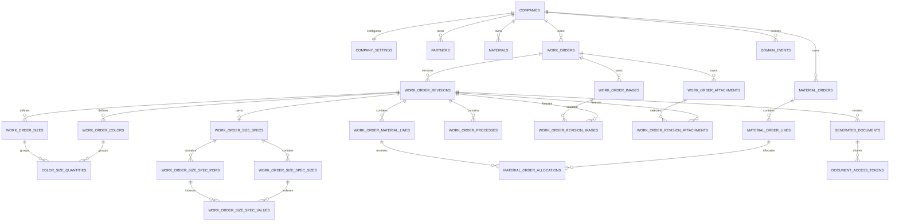

# WAFL v2 Core Domain Schema

Version: `2.0.0-alpha.19`
Status: canonical design draft; no migration SQL or DB mutation
Predecessor: `12-v1-db-api-performance-audit.md`

## 1. 설계 결론

v2의 중심은 `work_orders` identity와 immutable `work_order_revisions`다. 작성 중인 revision의 관계형 자식만 수정할 수 있고, 발행 시 revision을 확정한 뒤 동일 revision으로 생성한 문서 snapshot을 보존한다.

```text
work_order identity
  -> mutable draft revision
  -> finalized immutable revision
  -> generated document + immutable document DTO snapshot
```

이 모델은 현재값과 PDF 발행 당시 값을 분리한다. 목록은 bounded summary, 상세은 탭별 batch/lazy load, 모든 업무 query는 company scope를 첫 조건으로 사용한다.

## 2. 핵심 원칙

- 내부 PK는 PostgreSQL `uuid`다. 사용자 표시 문서번호와 분리한다.
- 모든 업무 row는 직접 `company_id`를 가지거나 company가 포함된 composite FK로 parent와 일치시킨다.
- calendar date는 `date`, 발생 시각은 `timestamptz`, 금액은 `numeric(14,2)`, 수량은 `numeric(14,3)`를 기본으로 한다.
- 상태와 검색 key는 typed column/check 또는 enum 후보로 둔다.
- 발행된 revision과 document snapshot은 update하지 않는다.
- revision 자식 collection은 관계형 row로 저장한다.
- JSONB는 document snapshot과 비정형 event metadata에만 제한한다.
- 삭제는 30일 soft-delete/restore window 후 purge job으로 처리한다.

## 3. Mermaid ERD



## 4. Tenant와 회사

### `companies` - KEEP_WITH_CHANGE

기존 회사 identity를 유지한다. v2 core에서 필요한 추가 책임은 `company_code`의 stable identity뿐이다.

| 필드 | 자료형 | 규칙 |
| --- | --- | --- |
| `id` | uuid 또는 transitional text | migration 단계에서 실제 기존 ID 정책과 조정 |
| `company_code` | varchar(16) | 대문자 영숫자/하이픈, active company 범위 unique |
| `name` | text | 현재 표시명 |
| `is_active` | boolean | 업무 생성 차단 기준 |
| `deleted_at` | timestamptz nullable | company 삭제 정책은 별도 운영 job |

### `company_settings` - KEEP_WITH_CHANGE

추가 후보:

- `business_timezone text not null default 'Asia/Seoul'`
- `document_number_prefix varchar(16)`
- `trash_retention_days integer not null default 30`

Timezone은 문서 일자와 일일 순번을 결정한다. 모든 server timestamp는 UTC `timestamptz`로 저장한다.

## 5. 작업지시서 identity와 revision

### `work_orders`

| 필드 | 자료형 | 책임 |
| --- | --- | --- |
| `id` | uuid PK | 내부 identity |
| `company_id` | FK | tenant owner |
| `document_number_base` | varchar(80) | revision suffix 없는 표시번호 |
| `product_name` | text | 목록 표시명 |
| `product_type_code` | text nullable | system/company category reference |
| `season_code` | varchar(16) nullable | 문서번호/검색용 구조화 code |
| `item_code` | varchar(24) nullable | 회사 품목 code |
| `status` | work_order_status | 현재 업무 상태 |
| `due_date` | date nullable | 납기 |
| `total_quantity` | integer | 0 이상 |
| `current_revision_id` | uuid FK nullable | 현재 편집/표시 revision |
| `representative_image_id` | uuid FK nullable | 현재 대표 이미지 |
| `created_by_member_id` | uuid FK | 생성자 membership |
| `assignee_member_id` | uuid FK nullable | 담당자 |
| `created_at`, `updated_at` | timestamptz | stable cursor 포함 |
| `deleted_at`, `purge_after_at` | timestamptz nullable | 30일 lifecycle |

Constraint:

- `unique(company_id, document_number_base)`.
- `total_quantity >= 0`.
- current revision/image는 동일 work order와 company에 속해야 한다.
- active query는 `deleted_at is null`.

### `work_order_revisions`

| 필드 | 자료형 | 책임 |
| --- | --- | --- |
| `id` | uuid PK | revision identity |
| `company_id`, `work_order_id` | FK | tenant/workorder |
| `revision_no` | integer | R0부터 증가 |
| `revision_status` | `draft` / `finalized` / `superseded` | 수정 가능성 |
| `revision_reason` | text nullable | R1 이상 권장/필수 정책 후보 |
| `source_revision_id` | uuid nullable | 복제 원본 |
| `author_member_id` | uuid FK | 작성자 |
| `finalized_by_member_id` | uuid nullable | 확정자 |
| `finalized_at` | timestamptz nullable | immutable 전환 시각 |
| `product_type`, `quantity`, `due_date` | typed snapshot columns | revision 기준 핵심 값 |
| `unit_price`, `fabric_total`, `accessory_total`, `process_total`, `estimated_total` | numeric(14,2) | 발행 revision의 금액 요약 |
| `memo` | text nullable | revision memo |
| `created_at`, `updated_at` | timestamptz | audit |

Constraint:

- `unique(work_order_id, revision_no)`.
- `revision_no >= 0`.
- finalized row는 application과 DB trigger/guard 후보에서 update/delete 금지.
- work order당 mutable draft는 최대 1개: partial unique 후보 `(work_order_id) where revision_status='draft'`.

Revision 생성 규칙:

1. 신규 작업지시서는 R0 draft.
2. 발행 전 수정은 R0 안에서 수행.
3. 발행/확정하면 R0 finalized.
4. 확정 후 수정 명령은 R0을 변경하지 않고 R1 draft를 복제 생성.
5. R1 발행 시 finalized, work order status는 `revised` 또는 업무상 다음 상태.

## 6. 표시용 문서번호

### 형식

```text
{COMPANY}-{SEASON}-{ITEM}-{YYMMDD}-{NNN}-R{REVISION}
SEOLO-SS-U-260711-003-R2
```

확정 정책:

- 순번 scope: 회사별 business date 전체. 품목별 순번이 아니다.
- timezone: `company_settings.business_timezone`, 미설정 시 `Asia/Seoul`.
- date: 최초 work order 생성 business date. revision마다 날짜를 바꾸지 않는다.
- 재발행: 동일 revision 재생성은 동일 표시번호 유지.
- 새 revision: base number 유지, suffix만 `R1`, `R2`로 증가.
- 내부 UUID와 문서번호는 독립.

### `document_number_sequences`

| 필드 | 자료형 | 규칙 |
| --- | --- | --- |
| `company_id` | FK | PK 일부 |
| `business_date` | date | PK 일부 |
| `last_sequence` | integer | 1 이상 |
| `updated_at` | timestamptz | 운영 확인 |

동시성은 같은 `(company_id, business_date)` row를 transaction 안에서 atomic upsert/row lock해 번호를 배정한다. `max()+1`은 사용하지 않는다.

문서번호의 회사/시즌/품목 code 변경 정책:

- base number는 생성 후 immutable.
- 회사명이나 화면 label 변경은 문서번호를 바꾸지 않는다.
- 잘못된 code는 번호 재사용 없이 작업지시서를 취소하고 새 identity를 만드는 것을 기본으로 한다.

## 7. 이미지와 첨부

### `work_order_images`

- `id uuid PK`, `company_id`, `work_order_id`.
- `storage_object_key text`, `thumbnail_object_key text nullable`.
- `original_filename text`, `mime_type text`, `size_bytes bigint`, `content_hash text nullable`.
- `title text nullable`, `display_order integer`, `is_current_representative boolean`.
- `created_by_member_id`, `created_at`, `deleted_at`, `purge_after_at`.

### `work_order_attachments`

이미지가 아닌 user asset metadata다. 필드는 images와 같고 `attachment_kind`, `output_include_default boolean`을 가진다. allowed MIME은 기존 image/PDF 정책을 유지한다.

### `work_order_revision_images`와 `work_order_revision_attachments`

발행 revision의 포함 자산을 고정한다.

- image link는 `revision_id`, `image_id`; attachment link는 `revision_id`, `attachment_id`를 사용해 각각 실제 FK를 보장한다.
- `display_order`, `is_representative`, `output_include`.
- `filename_snapshot`, `mime_type_snapshot`, `storage_object_key_snapshot`.

동일 revision의 representative image는 최대 1개다. user asset row가 나중에 soft-delete되어도 발행 document retention 기간에는 snapshot 관계를 유지한다. 실제 object purge는 발행 문서 참조/retention을 확인한다.

## 8. 원단·부자재와 발주

### `materials` - KEEP_WITH_CHANGE

회사 자재 master다. 작업지시서 입력은 master 없이도 가능하게 `material_id`를 nullable로 둔다.

### `work_order_material_lines`

| 필드 | 자료형 | 규칙 |
| --- | --- | --- |
| `id` | uuid PK | line identity |
| `company_id`, `revision_id` | FK | revision scope |
| `material_id` | uuid/text FK nullable | master reference |
| `material_type` | `fabric` / `accessory` | UI label과 분리 |
| `name`, `color_option` | text | 발행 당시 line 값 |
| `supplier_partner_id` | FK nullable | 거래처 |
| `required_quantity` | numeric(14,3) | 필요수량 |
| `allowance_quantity` | numeric(14,3) | 로스/여유 |
| `stock_quantity` | numeric(14,3) | 재고 사용 |
| `order_quantity` | numeric(14,3) | 발주수량 |
| `unit_code` | text | 구조화 단위 |
| `unit_price`, `amount` | numeric(14,2) | 0 이상 |
| `overage_disposition` | text nullable | 초과분 처리 code 후보 |
| `status` | material_line_status | editing/requested/completed/cancelled |
| `memo` | text nullable | 짧은 업무 메모 |
| `display_order` | integer | 탭 순서 |
| `image_id` | FK nullable | optional |
| timestamps | timestamptz | 상태 시각 포함 |

Validation:

- 모든 수량과 금액은 0 이상.
- 기본 계산은 `order_quantity = max(required + allowance - stock, 0)`이나 사용자가 권한 내에서 수정 가능.
- `amount = order_quantity * unit_price`는 server calculation을 source로 한다.
- finalized revision의 line은 immutable.

### `material_orders`, `material_order_lines`, `material_order_allocations`

v1 구조를 보강해 재사용한다.

- header: supplier, order number, status, requested/completed/cancelled timestamp, actor, total.
- line: 주문 당시 name/color/spec/unit/qty/price/amount snapshot.
- allocation: `work_order_material_line_id`를 직접 참조하고 allocation quantity를 보존.
- `completed_snapshot jsonb`는 completion command의 immutable provider/display summary로만 허용하며 `schema_version`을 함께 둔다.
- cancellation/completion은 `material_order_events` 또는 `domain_events`에 append한다.

## 9. 컬러·사이즈·수량

### `work_order_colors`

- `id`, `company_id`, `revision_id`, `code nullable`, `display_name`, `hex_value nullable`, `display_order`.
- unique `(revision_id, display_order)` 및 필요 시 `(revision_id, code)`.

### `work_order_sizes`

- `id`, `company_id`, `revision_id`, `size_code`, `display_label`, `display_order`.
- unique `(revision_id, size_code)`.

### `color_size_quantities`

- `company_id`, `revision_id`, `color_id`, `size_id`, `quantity integer`.
- PK `(revision_id, color_id, size_id)`.
- `quantity >= 0`.
- row의 color/size가 같은 revision/company에 속하도록 composite FK.

Validation:

- matrix 합계와 revision/work order `total_quantity`가 같아야 발행 가능.
- 구조화 입력을 사용하지 않는 작업지시서는 `quantity_matrix_note text` fallback을 revision에 둘 수 있다.
- memo fallback과 구조화 matrix를 동시에 source of truth로 쓰지 않는다.

## 10. 사이즈 스펙

v1의 4-table 패턴을 revision scope로 유지한다.

- `size_spec_templates`: company nullable(system)/company FK, gender/category/unit/schema version.
- `size_spec_template_poms`: template/POM/display order.
- `work_order_size_specs`: PK/FK revision, unit, source template/version.
- `work_order_size_spec_sizes`: revision/size code/label/order.
- `work_order_size_spec_poms`: revision/POM code/name/measurement type/instruction/order.
- `work_order_size_spec_values`: revision/size/POM, canonical decimal, optional display fraction.

cm/inch:

- canonical numeric은 cm 또는 record의 declared unit 중 하나로 일관되게 저장한다.
- inch 분수 UI 문자열은 `display_value`, 계산은 `decimal_value`.
- 발행 시 renderer는 revision의 unit과 value를 읽고 변환 규칙 version을 snapshot에 기록한다.

## 11. 제작 공정

### `work_order_processes`

- `id uuid`, `company_id`, `revision_id`.
- `process_type_code`, `process_name_snapshot`.
- `partner_id nullable`, `partner_name_snapshot nullable`.
- `quantity numeric(14,3)`, `unit_code`, `unit_price`, `amount`.
- `due_date date nullable`, `memo text nullable`.
- `status process_status`, `display_order integer`.
- `completed_at`, `completed_by_member_id`.

기본 6단계는 앱 flow summary이며 전부 DB process row가 아니다. 실제 외주/봉제/나염/자수/마감/검수 등 관리 대상만 row로 저장한다. completed process의 수정은 금지하고 정정은 새 revision 또는 별도 correction command로 기록한다.

## 12. 문서, PDF, QR

### `generated_documents`

| 필드 | 자료형 | 책임 |
| --- | --- | --- |
| `id` | uuid PK | document identity |
| `company_id`, `work_order_id`, `work_order_revision_id` | FK | source scope |
| `document_type` | typed code | work_instruction/factory_instruction/delivery_request 등 |
| `display_document_number` | varchar(96) | revision suffix 포함 |
| `status` | document_status | pending/generated/failed/revoked/deleted |
| `storage_object_key` | text nullable | raw URL 아님 |
| `file_size_bytes` | bigint nullable | 0 이상 |
| `content_sha256` | char(64) nullable | immutable evidence |
| `renderer_version` | text | renderer identity |
| `dto_schema_version` | integer | snapshot contract |
| `snapshot` | jsonb | immutable document DTO |
| `generated_at`, `revoked_at`, `deleted_at` | timestamptz | lifecycle |
| `failure_code` | text nullable | 비밀 없는 code |

Constraint:

- generated 상태에는 object key/size/hash/generated_at 필수.
- `unique(company_id, display_document_number, document_type)`은 같은 revision/type 재생성 정책과 충돌할 수 있으므로 generation sequence를 별도 두거나 active generation partial unique를 사용한다.
- 권장: business display number는 revision에 고정하고, document row는 `generation_no`를 가져 `unique(revision_id, document_type, generation_no)`로 관리한다.
- 이전 생성본을 덮어쓰지 않는다. 새 generation 성공 후 current pointer만 전환하고 retention 정책에 따라 revoke/delete한다.

### `document_access_tokens`

- `id uuid`, `company_id`, `generated_document_id`.
- raw token은 반환 시 1회만 생성하고 DB에는 `token_hash`만 저장.
- `expires_at`, `revoked_at`, `last_accessed_at`, optional access count.
- QR에는 raw work order UUID가 아니라 이 opaque token URL을 넣는다.
- token으로 document를 읽을 때 status/expiry/revoke/company policy를 모두 검사한다.

R2 key는 `companies/{opaque-company-id}/workorders/{work-order-id}/documents/{document-id}.pdf`처럼 opaque ID만 사용하고 고객명/거래처명/제품명을 넣지 않는다.

## 13. Audit와 history

### `domain_events`

- `id uuid`, `company_id`, `entity_type`, `entity_id`, `command_code`.
- `actor_member_id nullable`, `occurred_at timestamptz`, `correlation_id`.
- `change_summary text nullable`, `metadata jsonb`, `schema_version integer`.
- before/after 전체 row JSON은 저장하지 않는다.
- secret, token, raw signed URL, 불필요한 이메일/개인정보는 금지한다.

운영 보안 audit와 사용자 업무 history는 view/retention을 분리하되, 동일 command correlation을 가질 수 있다.

## 14. 상태 머신

UI 한국어 label은 presentation에서 변환한다. DB에는 아래 internal code를 저장한다.

### 작업지시서 상태

| 상태 | 허용 transition | 수정/잠금 | revision/audit/PDF |
| --- | --- | --- | --- |
| `draft` | ready_to_issue, cancelled | current draft 수정 가능 | field command audit; PDF는 incomplete generation 가능 |
| `ready_to_issue` | issued, draft, cancelled | 발행 전 제한 수정 | draft 복귀 audit; issue 시 revision finalize |
| `issued` | revised, completed, cancelled | finalized revision 잠금 | 수정 시작 시 새 revision; 기존 PDF 유지 |
| `revised` | issued, completed, cancelled | 새 current draft만 수정 | 새 revision finalize 후 PDF 새 generation |
| `completed` | revised(권한/사유 필요) | 기본 잠금 | correction revision event 필요 |
| `cancelled` | draft(발행 전만), revised(발행 후 정정 정책) | 기본 잠금 | 문서 revoke 검토, audit 필수 |

금지: finalized revision 직접 수정, completed에서 이유 없는 draft 전환, cancelled row의 silent restore.

### 개별 자재 상태

| 상태 | 허용 transition | 수정 | event/PDF |
| --- | --- | --- | --- |
| `editing` | requested, cancelled | 가능 | request 시 command event |
| `requested` | completed, cancelled | 주문 핵심 필드 잠금 | order reference와 requested snapshot |
| `completed` | 없음; 별도 correction | 잠금 | completion event, 발행 문서는 새 revision에서 반영 |
| `cancelled` | editing(권한/사유) | 잠금 | cancel/reopen event |

### 자재 전체 flow 상태

- `ready`: 요청 대상이 없거나 모두 editing.
- `in_progress`: requested/completed가 섞였거나 미완료 존재.
- `completed`: 필요한 모든 active line이 completed.

이는 persisted source가 아니라 line status에서 계산하는 projection을 기본으로 한다.

### 공정 상태

`ready -> in_progress -> completed`. completed에서 역전환은 금지하고 correction command와 audit가 필요하다.

### 문서 상태

- `pending -> generated | failed`.
- `failed -> pending`은 새 retry/generation row 권장.
- `generated -> revoked -> deleted`.
- `generated -> deleted` 직접 전환은 purge/보안 사유와 audit가 있을 때만.
- deleted row의 object cleanup 실패는 별도 cleanup state/job에서 재시도한다.

## 15. 목록, 상세, 검색 계약

### 목록 API

예시: `GET /api/v2/work-orders?limit=30&cursor=...&status=...&q=...`

- company scope는 session membership에서 강제한다.
- 기본 30, 최대 50.
- stable sort 기본 `(updated_at desc, id desc)`.
- cursor는 마지막 `(updated_at,id)`를 서명/인코딩한 opaque 값.
- due-date sort는 `(due_date asc nulls last,id)`처럼 별도 cursor contract.

반환:

- work_order_id, document number, product name, status, due date, total quantity.
- estimated total.
- representative thumbnail 1개.
- fabric/accessory incomplete count, process count, latest document status.
- updated_at, next_cursor.

반환 금지:

- 전체 attachment/image/material/process/size matrix.
- document snapshot 또는 raw storage key.

Query 전략:

1. indexed work order page에서 30개 ID를 먼저 결정.
2. 그 30개 ID에 대해서만 aggregate/count/thumbnail을 batch join.
3. row별 application query는 금지.

### 상세 API

- `GET /api/v2/work-orders/:id`: identity, revision summary, tab counts, 대표 thumbnail.
- `GET .../:id/materials?type=fabric`: preview 또는 bounded collection.
- `GET .../:id/materials?type=accessory`.
- `GET .../:id/size-color`, `/size-spec`, `/processes`, `/assets`, `/documents`, `/history`.
- 초기 detail은 1 core + 필요한 batch 1~3 query를 목표로 하고 선택하지 않은 탭을 먼저 읽지 않는다.
- 각 collection은 보통 한 work order 최대치가 작지만 100개 이상 가능성을 고려해 `limit/cursor`를 지원할 수 있다.

### 검색

- 첫 predicate는 company_id.
- 제품명/문서번호/status/due date는 `work_orders` typed column.
- 거래처/공장/자재명은 indexed child EXISTS query 또는 두 단계 ID search.
- normalized search field는 lowercase/whitespace normalization까지만 우선한다.
- 5,000건 contains 검색이 목표를 못 맞출 때 `pg_trgm` 또는 PostgreSQL FTS를 검토한다. 별도 검색엔진은 도입하지 않는다.

## 16. 인덱스 설계

실제 생성은 alpha.21 EXPLAIN 이후다.

| index 후보 | 지원 query | column order / partial |
| --- | --- | --- |
| work order recent | 회사 최신 목록 | `(company_id, updated_at desc, id desc) where deleted_at is null` |
| work order status | 상태별 최신 목록 | `(company_id, status, updated_at desc, id desc) where deleted_at is null` |
| work order due | 납기 목록 | `(company_id, due_date asc, id) where deleted_at is null` |
| work order trash | 휴지통/purge | `(company_id, deleted_at desc, id) where deleted_at is not null` 및 purge job partial |
| document number | 직접 조회 | unique `(company_id, document_number_base)` |
| revision | current/version | unique `(work_order_id, revision_no)`; one draft partial unique |
| material lines | 탭 정렬 | `(revision_id, material_type, display_order, id)` |
| material status | 회사 발주 queue | `(company_id, status, updated_at, id)`는 실제 queue query가 있을 때만 |
| images/assets | 대표/순서 | `(work_order_id, display_order, id) where deleted_at is null`; representative partial unique |
| process | 탭 정렬 | `(revision_id, display_order, id)` |
| color-size | matrix lookup | PK `(revision_id,color_id,size_id)` 및 size 조회 필요 시 별도 index |
| document | 최신 generation | `(work_order_revision_id, document_type, created_at desc, id)` |
| token | share lookup | unique `token_hash`; `(expires_at)` cleanup partial |
| event | history | `(company_id, entity_type, entity_id, occurred_at desc, id)` |

중복 index는 predicate와 sort가 같은 경우 합친다. `company_id` 없는 전역 index는 system operation이 실제로 요구할 때만 둔다.

## 17. 삭제, restore, purge

- work order 삭제는 `deleted_at`, `purge_after_at = deleted_at + 30 days`.
- 30일 안에는 work order와 child/current asset metadata를 restore할 수 있다.
- child는 parent 삭제로 즉시 물리 삭제하지 않는다. parent visibility로 숨기고 별도 purge manifest가 처리한다.
- finalized revision/document metadata는 retention/legal 정책을 확인하고 purge한다.
- share token은 삭제 즉시 revoke한다.
- generated document object는 revoke 후 cleanup job이 R2 삭제를 수행하고 결과를 audit한다.
- purge 실패는 retry 가능 state와 failure code를 남긴다.

## 18. 성능 예산 초안

Neon/PostgreSQL과 Next/Expo API의 실제 region/latency를 아직 측정하지 않았으므로 과도하게 공격적인 수치로 확정하지 않는다.

| 항목 | alpha.21 제안 gate |
| --- | --- |
| 목록 DB query p95 | 500건 <= 100ms, 5,000건 <= 200ms (dev/test DB server timing) |
| 상세 core+선택 탭 DB p95 | <= 250ms |
| indexed 검색 DB p95 | <= 250ms |
| 목록 API server p95 | <= 500ms, network 제외 별도 기록 |
| 목록 payload | 30건 gzip 전 <= 150KB, 목표 <= 100KB |
| 상세 초기 payload | gzip 전 <= 300KB; 탭 데이터 제외 |
| 목록 query count | 1~3, row 수에 비례하지 않음 |
| 상세 초기 query count | 1~4, 탭별 추가 query 명시 |
| React initial rows | 최대 page size 30 또는 50 |
| cursor page size | 기본 30, 최대 50 |

## 19. OPEN DECISION

확정 정책을 되돌리지 않는 범위에서 다음만 남는다.

- 회사/브랜드 code와 시즌/품목 code를 누가 생성·변경하는지.
- 발행된 최종 문서의 보존 기간/개수와 superseded generation purge 시점.
- material inventory source of truth를 v1 `material_stocks`와 `material_inventory_lots` 중 어느 쪽으로 수렴할지.
- 작업지시서 completion 후 correction을 `revised`로만 허용할지 별도 `correction` 상태를 둘지.
- v2 deployed DB에 RLS를 도입할 정확한 phase와 system-admin policy.

## 20. 다음 action

`14-v2-schema-migration-and-performance-plan.md`에 따라 additive shadow schema, dual-read 검증, backfill, performance gate 순서로 진행한다. 이 문서는 migration 실행을 승인하지 않는다.
