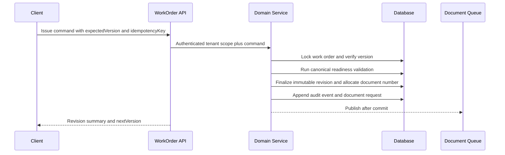

# WAFL v2 WorkOrder API, Command, and Read Model Contracts

## Issued revision Preview

`GET /api/v2/work-orders/:workOrderId/revisions/:revisionId/preview` returns `WorkOrderIssuedPreviewReadModel` only for an explicitly matched finalized/superseded revision under the authenticated tenant. It does not infer `current_revision_id`, return raw snapshots, or expose storage/token fields.

Version: `2.0.0-alpha.20`
Status: canonical type/API contract; no route or DB implementation

TypeScript source: `lib/domain/work-orders/contracts/`

## 1. Contract layers

```text
DB row
-> repository projection
-> domain command/read service
-> API DTO
-> mobile/web consumer
```

DB row, command input, read model, UI state를 같은 타입으로 재사용하지 않는다. alpha.20 contracts는 runtime API에 연결하지 않는다.

## 2. Primitives

Branded types:

- identity: `WorkOrderId`, `WorkOrderRevisionId`, `CompanyId`, `PartnerId`, `MaterialId`, `MaterialLineId`, `ProcessId`, `ImageId`, `AttachmentId`, `GeneratedDocumentId`.
- transport: `OpaqueCursor`, `OpaqueDocumentAccessToken`.
- temporal: `IsoDate`, `IsoDateTime`.
- numeric: `DecimalString`, `CurrencyCode`, `RevisionNumber`, `EntityVersion`.

Rules:

- IDs and display codes are not interchangeable.
- decimal quantity/money uses decimal string at the API boundary.
- calendar values use ISO date; instants include timezone.
- `companyId` is derived from authenticated context, not command body.

## 3. State contracts

### Work order

| Internal state | UI label | Editable | Transition | Revision/document effect |
| --- | --- | --- | --- | --- |
| `draft` | 작성중 | yes | ready_to_issue, cancelled | current draft only |
| `ready_to_issue` | 발행 준비 | limited | draft, issued, cancelled | issue finalizes revision |
| `issued` | 발행됨 | no | revised, completed, cancelled | correction creates new draft |
| `revised` | 정정 작성중 | new draft only | issued, cancelled | issue generates new revision document |
| `completed` | 완료 | no | revised | old revision remains immutable |
| `cancelled` | 취소 | no | none | active share/document revoke policy |

`revised`는 correction 자체가 아니라 issued/completed work order에 새 revision draft가 존재하는 상태다.

### Revision

- `draft`: mutable current revision.
- `finalized`: immutable issued revision.
- `superseded`: newer finalized revision exists; still retained.
- `cancelled`: abandoned draft.

### Material line

- `editing -> requested -> completed`.
- `requested -> cancelled -> editing`은 사유가 있는 취소 흐름.
- completed는 수정/reopen하지 않는다.

### Process

- `ready -> in_progress -> completed`.
- completed reopen은 금지; correction revision에서 새 row를 만든다.

### Generated document

- `pending -> generated | failed`.
- generated -> revoked -> deleted.
- failed retry는 동일 row mutation보다 새 generation attempt를 권장한다.

상태 transition constant에는 허용 transition, editable, revision 생성, audit event, document effect가 포함된다.

## 4. List read model

`WorkOrderListItem`은 목록 판단에 필요한 값만 반환한다.

- WorkOrder ID, 표시 문서번호, 제품명, 상태, 납기, 총수량.
- 예상 금액 요약.
- 대표 thumbnail metadata 1개. controlled thumbnail route가 아직 없거나 object가 없는 fixture는 URL을 `null`로 둔다.
- 미완료 fabric/accessory count와 실제 process count.
- 최신 generated document status.
- updated timestamp.

금지:

- 전체 image/attachment/material/process/matrix/document snapshot.
- storage object key.
- raw access token.
- internal audit metadata.

`WorkOrderListPage`는 `items`, `nextCursor`, `hasMore`, `limit`을 가진다.

## 5. Cursor pagination

- default limit 30, maximum 50.
- default stable key `(updated_at desc, id desc)`.
- cursor는 마지막 sort tuple을 서명/인코딩한 opaque string.
- offset pagination은 기본으로 사용하지 않는다.
- invalid/tampered cursor는 `CURSOR_INVALID`.
- limit 초과는 clamp가 아니라 `LIMIT_EXCEEDED` 또는 documented clamp 중 API 구현 시 하나를 고정한다. 이 계약은 오류 반환을 기본으로 한다.

Query shape:

1. tenant/status/search predicate로 page ID를 먼저 선택.
2. 해당 ID에 대해서만 thumbnail/count/readiness summary를 batch aggregate.
3. next cursor는 반환된 마지막 row에서 생성.
4. duplicate/missing row 없이 stable order를 유지.

Search/filter:

- status.
- due/updated date range.
- product/style name.
- partner/factory.
- material name.
- active/trash scope.

모든 query의 첫 범위는 authenticated company다.

## 6. Detail and tab read models

### Header

`WorkOrderDetailHeader`:

- identity/basic product/season/category/item code.
- due date/total quantity/status/current revision.
- readiness/representative image/document summary/entity version.

### Overview

`WorkOrderOverviewReadModel`:

- 참여 업체.
- 다음 확인.
- 단가 및 fabric/accessory/process/estimated total.
- 현재 상태.

### Images and attachments

`WorkOrderImagesReadModel`:

- image/attachment list, representative, display order, optional title.
- MIME/size, WAFL-controlled thumbnail/view URL, deleted state, upload time.
- document include flag.

Raw storage key는 없다.

### Size and color

`WorkOrderSizeColorReadModel`:

- gender/category/unit/template.
- size rows, POM columns, size cells.
- colors and bounded color-size quantity cells.
- matrix total/expected total/match result/memo fallback.

### Materials

`WorkOrderMaterialsReadModel`:

- fabric/accessory line 분리.
- partner, option, required/allowance/inventory/order quantity.
- unit price/amount/memo/status/order/display order.
- editable/locked projection.

Inventory usage는 lot/ledger source에서 계산한다. aggregate stock table은 read cache일 뿐이다.

### Processes

`WorkOrderProcessesReadModel`:

- app 6-step flow summary.
- 실제 process detail rows.
- partner/quantity/due/unit/price/amount/memo/status/order/lock.

### Documents

`WorkOrderDocumentsReadModel`:

- revision list와 generated documents.
- display number, renderer/document schema version, generated/revoked status.
- include configuration, access-token availability, preview readiness.

Snapshot JSON, object key, token hash/raw token은 반환하지 않는다.

각 tab은 lazy-load endpoint 또는 동등한 bounded query contract로 구현한다.

## 7. Command principles

- giant `workOrder` object 금지.
- changed field 또는 bounded collection command만 받는다.
- command body에 `companyId` 금지.
- 주요 mutation은 `expectedVersion` 필수.
- issue/complete는 idempotency key 필수.
- read DTO를 command input으로 재사용하지 않는다.

### Draft/basic

- `CreateWorkOrderDraftCommand`.
- `PatchWorkOrderBasicInfoCommand`.

Company/brand code는 customer admin setting에서, season/item code는 approved catalog에서 resolve한다.

### Images/attachments

- add/reorder/set representative/remove/update optional title.
- attachment document include toggle.

이 command는 upload bytes를 전달하지 않는다. upload prepare/complete contract는 별도 file lifecycle phase다.

### Materials

- add/patch/reorder/remove line.
- request/cancel/complete material order.

Requested line은 locked, cancellation reason 후 editing 가능, completed line은 immutable하다.

### Size/color

- patch size cell, add/remove size/POM.
- upsert color and color-size cells.
- save/load template.

Color-size cell batch maximum은 250이다. 일반 최대 12x12 matrix를 한 번에 처리할 여유를 주되 무제한 payload를 막는다.

### Processes

- add/patch/reorder/complete process.
- completed reopen command는 없다.

### Revision/issue

- create revision draft with source revision and correction reason.
- issue work order.
- cancel draft revision.
- revoke generated document.

Alpha.27 narrows `issue work order` to the applied-schema vertical slice: current draft identity plus WorkOrder/revision expected versions, required idempotency, server-owned document number and issue time, one finalized revision, no automatic next draft, and no generated document/PDF/QR/R2 effect. The existing `workorder.update` permission is reused because the active catalog has no separate issue code.

Issue transaction:



Document generation failure does not roll back the finalized revision. It produces a failed document attempt that can be retried as a new attempt.

## 8. Readiness

`ReadinessReadModel` includes:

- `canIssue`.
- `hardBlockers` and `warnings`.
- `checkedAt`, `basedOnVersion`.
- source: server canonical or client preview.

Hard blockers:

- representative image missing.
- total quantity missing.
- matrix total mismatch.
- fabric missing.
- accessory state unspecified.
- due date missing.
- factory/delivery target missing.

Warnings:

- accessory confirm later.
- memo fallback instead of structured quantity.
- no included attachment.
- process partner unassigned.

Client preview는 UX용이며 server canonical validation을 대체하지 않는다.

## 9. Optimistic concurrency and idempotency

- explicit integer `EntityVersion`.
- mutation request `expectedVersion`.
- success response `nextVersion`.
- mismatch response HTTP 409 `CONFLICT` with current entity version and correlation ID.
- 최신 full entity를 충돌 응답에 자동 포함하지 않는다.
- issue/order-complete/process-complete/document-revoke는 idempotency key로 duplicate effect를 막는다.

## 10. Error envelope

```text
error.code
error.message
error.fieldErrors optional
error.entityVersion optional
error.retryable
error.correlationId
```

Code set에는 validation/auth/forbidden/tenant/not-found/conflict/locked/transition/revision/document/readiness/cursor/limit/rate/internal 오류가 포함된다.

Tenant member path의 cross-company opaque ID는 resource enumeration을 막기 위해 기본 `NOT_FOUND`로 처리한다. 명시적 권한 부족은 `FORBIDDEN`. DB error/raw SQL/token/stack trace는 response에 포함하지 않는다.

## 11. Tenant, permission, and RLS contract

- tenant scope는 authenticated membership에서 생성한다.
- 모든 repository read/write method는 scope를 필수 인자로 받는다.
- tenant table은 직접 `company_id` 또는 검증 가능한 composite FK 경로를 가진다.
- RLS session claim에 company/member/correlation context를 설정한다.
- 일반 tenant policy는 claim company와 row company 일치를 강제한다.
- service role은 migration/controlled background job에만 사용하며 customer API의 일반 우회 수단이 아니다.
- privileged system path는 별도 scope와 endpoint/service를 사용한다.
- privileged request는 target company, actor, reason, correlation과 audit event가 필수다.

실제 RLS SQL은 alpha.21 draft, alpha.22 dev/test verification 범위다.

## 12. Document number, revision, and QR

Format:

```text
SEOLO-SS-U-260711-003-R2
```

- company-wide daily sequence in company business timezone.
- base number allocated once at work order creation/first issue policy boundary and retained.
- new finalized revision changes only `R` suffix.
- code edits do not rewrite prior finalized number; revision stores code snapshot.
- concurrent allocation uses atomic sequence row, never `max()+1`.
- unique base per company and unique revision number per work order.
- all R0/R1/R2 generated documents are retained with the work order.

QR/share:

- opaque random token, raw UUID 없음.
- DB stores hash only.
- token has expiry/revoke/rotate policy.
- rotation creates new token and revokes previous token.
- work order trash immediately revokes active external access; 30-day purge removes eligible document objects by manifest.

## 13. Payload and query budget

Provisional alpha.20 contract:

| Operation | Query budget | Payload budget |
| --- | --- | --- |
| list default 30 | <= 3 DB round trips | <= 150KB uncompressed |
| list maximum 50 | <= 3 DB round trips | <= 200KB uncompressed |
| detail header | <= 3 DB round trips | <= 120KB uncompressed |
| each tab read | <= 3 DB round trips | bounded by collection cursor/chunk |

DB p95 proposal from alpha.19:

- 500-row list <= 100ms.
- 5,000-row list <= 200ms.
- detail core + selected tab <= 250ms.
- indexed search <= 250ms.
- list API server <= 500ms excluding client network.

Actual p95 is confirmed in alpha.22 benchmark. `SELECT *`, full child JSON aggregation, row N+1, full child delete/reinsert, and original image metadata in list are forbidden.

## 14. Runtime boundary

Alpha.26 specializes the material contract against the applied schema. Fabric/accessory share `work_order_material_lines`; create and request/cancel/complete use actor-scoped hashed receipts, while scalar PATCH uses WorkOrder `expectedVersion`. WorkOrder, current draft revision, and line versions advance atomically. Only `editing -> requested` and `requested -> cancelled|completed` are allowed. Amount is server-derived, cross-tenant material/supplier references are generic `NOT_FOUND`, and no DELETE is exposed because no soft-delete lifecycle exists.

Alpha.20에서는 어떤 runtime도 이 계약을 import하지 않았다. Alpha.23은 `GET /api/v2/work-orders` 목록 vertical slice를 채택했고, alpha.24는 core detail과 일곱 tab-specific lazy Read endpoint만 추가한다. `apps/mobile`, command route, PDF/QR route는 여전히 연결하지 않는다.

Alpha.23 route는 기존 workspace session/permission guard, dev/test fingerprint gate, `NOBYPASSRLS` RLS role, read-only transaction을 사용한다. Production에서는 명시 feature/approval gate가 없어 route가 DB-backed guard보다 먼저 차단된다.

Alpha.24 collection cursor는 company/visibility/WorkOrder/tab kind에 서명으로 결합된다. Core와 각 탭 repository callback은 claims와 한 bounded SQL, 두 statement로 유지하며 endpoint 전체 protocol call 수와 구분한다.

Alpha.25는 `CreateWorkOrderDraftCommand`를 실제 적용 schema에 맞춰 actor-scoped idempotency, nullable `productTypeCode`/season/item/due date, quantity, memo로 좁히고 `PatchWorkOrderBasicInfoCommand`를 current draft scalar update에만 연결한다. Valid mutation은 별도 owner approval 전 실행하지 않으며, create/R0/event/receipt와 patch/current-revision/event는 각각 한 tenant-role transaction을 사용한다.
