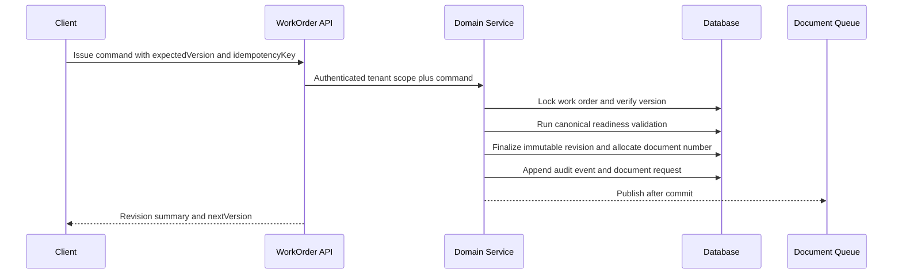

# WAFL v2 WorkOrder API, Command, and Read Model Contracts

## Alpha.67 identity lock, source-backed basic spec, and readiness severity

`work_order.set_sample` is a draft-only command. Its update predicate requires both WorkOrder `draft` and current revision `draft`; issued/finalized/read-only records return `LOCKED`. The pre-existing Reorder/Sample invariant remains a separate validation guard.

`WAFL_BASIC_SPEC_V1` is source-backed product/reference data with four deterministic system template identities. Normal Maker template listing classifies only the current category-matched source template as a WAFL recommendation and combines it with tenant/company templates; persisted QA/legacy system templates remain stored but are not returned as normal Maker recommendations. The policy neither persists nor mutates the product seed. Apply runs inside the existing measurement transaction, stores cm as SOT, rebuilds only currently selected WorkOrder size rows, imports matching values only, and leaves custom sizes value-empty. Company template save/update continues to create independent company-owned versions.

The same `evaluateWorkOrderIssueReadiness` result controls mobile readiness and issue permission. Fabric/Accessory absence and incomplete optional material detail codes are warnings; they remain in the complete issue array but never enter hard blockers. Basic Process, identity/document, representative image, quantity, date, and other established hard prerequisites remain unchanged.

Public viewer session/file/download authorization is unchanged. `/v` gives the session-authorized PDF bytes to a self-hosted PDF.js worker and canvas page renderer; internal workspace file routes remain session-protected and raw object storage URLs are never exposed.

Issued Preview process roles are immutable render input. PDF cover presentation resolves the Basic
Process human partner name from the issued snapshot. Detail process presentation filters the same
snapshot to Additional roles only and omits an empty Additional section. Internal revision fields
remain part of document identity even though the user-facing `개정차수` row is not rendered.

Document role: normative owner for WorkOrder API DTO, state, error, pagination, tenant, permission, concurrency, and command/read-model semantics. It defines what the API means; `17-v2-api-contract-test-plan.md` defines how those semantics are verified. Version-specific results belong to numbered evidence, and execution/approval rules belong to `09-codex-working-rules.md`.

## Calendar date-only serialization

- `IsoDate` represents a calendar value whose API form is exactly `YYYY-MM-DD`; it is not an instant or timezone-bearing datetime.
- PostgreSQL `date` should cross the SQL/repository boundary as text and be validated as a real calendar date. Converting it through JavaScript `Date`, UTC, or `toISOString().slice(0, 10)` is forbidden.
- PostgreSQL `timestamp` and `timestamptz` keep the existing ISO datetime contract and must not use the date-only serializer.

## Alpha.30 factory instruction extension

- `usageArea`, `applicationArea`, `applicationColorTarget`, and `factoryDeliveryMemo` are nullable trimmed text with limits 1,000/1,000/1,000/5,000.
- Process write is limited to PATCH of an existing process in the current draft revision. No create/delete/status/reorder contract is activated.
- Issued Preview reads these fields from the explicit issued revision and omits operational inventory/order/cost/status fields from factory presentation.

## Issued revision Preview

`GET /api/v2/work-orders/:workOrderId/revisions/:revisionId/preview` returns `WorkOrderIssuedPreviewReadModel` only for an explicitly matched finalized/superseded revision under the authenticated tenant. It does not infer `current_revision_id`, return raw snapshots, or expose storage/token fields.

Version: `2.0.0-alpha.20`
Status: canonical type/API contract; no route or DB implementation

TypeScript source: `lib/domain/work-orders/contracts/`

## 1. Contract layers

```text
DB row
-> repository projection
-> domain command/read service
-> API DTO
-> mobile/web consumer
```

DB row, command input, read model, UI state를 같은 타입으로 재사용하지 않는다. alpha.20 contracts는 runtime API에 연결하지 않는다.

## 2. Primitives

Branded types:

- identity: `WorkOrderId`, `WorkOrderRevisionId`, `CompanyId`, `PartnerId`, `MaterialId`, `MaterialLineId`, `ProcessId`, `ImageId`, `AttachmentId`, `GeneratedDocumentId`.
- transport: `OpaqueCursor`, `OpaqueDocumentAccessToken`.
- temporal: `IsoDate`, `IsoDateTime`.
- numeric: `DecimalString`, `CurrencyCode`, `RevisionNumber`, `EntityVersion`.

Rules:

- IDs and display codes are not interchangeable.
- decimal quantity/money uses decimal string at the API boundary.
- calendar values use ISO date; instants include timezone.
- `companyId` is derived from authenticated context, not command body.

## 3. State contracts

### Work order

| Internal state | UI label | Editable | Transition | Revision/document effect |
| --- | --- | --- | --- | --- |
| `draft` | 작성중 | yes | ready_to_issue, cancelled | current draft only |
| `ready_to_issue` | 발행 준비 | limited | draft, issued, cancelled | issue finalizes revision |
| `issued` | 발행됨 | no | revised, completed, cancelled | correction creates new draft |
| `revised` | 정정 작성중 | new draft only | issued, cancelled | issue generates new revision document |
| `completed` | 완료 | no | revised | old revision remains immutable |
| `cancelled` | 취소 | no | none | active share/document revoke policy |

`revised`는 correction 자체가 아니라 issued/completed work order에 새 revision draft가 존재하는 상태다.

### Revision

- `draft`: mutable current revision.
- `finalized`: immutable issued revision.
- `superseded`: newer finalized revision exists; still retained.
- `cancelled`: abandoned draft.

### Material line

- `editing -> requested -> completed`.
- current command의 취소는 `requested -> editing`이며 사유, `cancelled_at`, event를 이력으로 보존한다.
- alpha.26에서 이미 저장된 `cancelled` row는 migration하지 않는 legacy terminal/read-only compatibility data다.
- completed는 수정/reopen하지 않는다.

### Process

- `ready -> in_progress -> completed`.
- completed reopen은 금지; correction revision에서 새 row를 만든다.

### Generated document

- `pending -> generated | failed`.
- generated -> revoked -> deleted.
- failed retry는 동일 row mutation보다 새 generation attempt를 권장한다.

상태 transition constant에는 허용 transition, editable, revision 생성, audit event, document effect가 포함된다.

## 4. List read model

`WorkOrderListItem`은 목록 판단에 필요한 값만 반환한다.

- WorkOrder ID, 표시 문서번호, 제품명, 상태, 납기, 총수량.
- 예상 금액 요약.
- 대표 thumbnail metadata 1개. controlled thumbnail route가 아직 없거나 object가 없는 fixture는 URL을 `null`로 둔다.
- 미완료 fabric/accessory count와 실제 process count.
- 최신 generated document status.
- updated timestamp.

금지:

- 전체 image/attachment/material/process/matrix/document snapshot.
- storage object key.
- raw access token.
- internal audit metadata.

`WorkOrderListPage`는 `items`, `nextCursor`, `hasMore`, `limit`을 가진다.

## 5. Cursor pagination

- default limit 30, maximum 50.
- default stable key `(updated_at desc, id desc)`.
- cursor는 마지막 sort tuple을 서명/인코딩한 opaque string.
- offset pagination은 기본으로 사용하지 않는다.
- invalid/tampered cursor는 `CURSOR_INVALID`.
- limit 초과는 clamp가 아니라 `LIMIT_EXCEEDED` 또는 documented clamp 중 API 구현 시 하나를 고정한다. 이 계약은 오류 반환을 기본으로 한다.

Query shape:

1. tenant/status/search predicate로 page ID를 먼저 선택.
2. 해당 ID에 대해서만 thumbnail/count/readiness summary를 batch aggregate.
3. next cursor는 반환된 마지막 row에서 생성.
4. duplicate/missing row 없이 stable order를 유지.

Search/filter:

- status.
- due/updated date range.
- product/style name.
- partner/factory.
- material name.
- active/trash scope.

모든 query의 첫 범위는 authenticated company다.

## 6. Detail and tab read models

### Header

`WorkOrderDetailHeader`:

- identity/basic product/season/category/item code.
- due date/total quantity/status/current revision.
- readiness/representative image/document summary/entity version.

### Overview

`WorkOrderOverviewReadModel`:

- 참여 업체.
- 다음 확인.
- 단가 및 fabric/accessory/process/estimated total.
- 현재 상태.

### Images and attachments

`WorkOrderImagesReadModel`:

- image/attachment list, representative, display order, optional title.
- MIME/size, WAFL-controlled thumbnail/view URL, deleted state, upload time.
- document include flag.

Raw storage key는 없다.

### Size and color

`WorkOrderSizeColorReadModel`:

- gender/category/unit/template.
- size rows, POM columns, size cells.
- colors and bounded color-size quantity cells.
- matrix total/expected total/match result/memo fallback.

### Materials

`WorkOrderMaterialsReadModel`:

- fabric/accessory line 분리.
- partner, option, required/allowance/inventory/order quantity.
- unit price/amount/memo/status/order/display order.
- editable/locked projection.

Inventory usage는 lot/ledger source에서 계산한다. aggregate stock table은 read cache일 뿐이다.

### Processes

`WorkOrderProcessesReadModel`:

- app 6-step flow summary.
- 실제 process detail rows.
- partner/quantity/due/unit/price/amount/memo/status/order/lock.

### Documents

`WorkOrderDocumentsReadModel`:

- revision list와 generated documents.
- display number, renderer/document schema version, generated/revoked status.
- include configuration, access-token availability, preview readiness.

Snapshot JSON, object key, token hash/raw token은 반환하지 않는다.

각 tab은 lazy-load endpoint 또는 동등한 bounded query contract로 구현한다.

## 7. Command principles

- giant `workOrder` object 금지.
- changed field 또는 bounded collection command만 받는다.
- command body에 `companyId` 금지.
- 주요 mutation은 `expectedVersion` 필수.
- issue/complete는 idempotency key 필수.
- read DTO를 command input으로 재사용하지 않는다.

### Draft/basic

- `CreateWorkOrderDraftCommand`.
- `PatchWorkOrderBasicInfoCommand`.

Company/brand code는 customer admin setting에서, season/item code는 approved catalog에서 resolve한다.

### Images/attachments

- add/reorder/set representative/remove/update optional title.
- attachment document include toggle.

이 command는 upload bytes를 전달하지 않는다. upload prepare/complete contract는 별도 file lifecycle phase다.

Alpha.64 uses this one toggle as the canonical issuance-time selection owner. Supported image
attachments may additionally render inside the main work-instruction PDF. Every selected
attachment type is frozen in the immutable generated-document asset manifest and becomes a
controlled delivery attachment under the same Viewer token/session. The public read model
contains only bounded filename/MIME/size plus opaque attachment references; storage keys,
signed Worker URLs, and raw revision-asset IDs remain server-only. Viewer attachment reads
revalidate active token/document state and object size/SHA/MIME on every request.

### Materials

- add/patch/reorder/remove line.
- request/cancel/complete material order.

Requested line은 locked, cancellation reason 후 editing 가능, completed line은 immutable하다.

### Size/color

- patch size cell, add/remove size/POM.
- upsert color and color-size cells.
- save/load template.

Color-size cell batch maximum은 250이다. 일반 최대 12x12 matrix를 한 번에 처리할 여유를 주되 무제한 payload를 막는다.

### Processes

- add/patch/reorder/complete process.
- completed reopen command는 없다.

### Revision/issue

- create revision draft with source revision and correction reason.
- issue work order.
- cancel draft revision.
- revoke generated document.

Alpha.27 narrows `issue work order` to the applied-schema vertical slice: current draft identity plus WorkOrder/revision expected versions, required idempotency, server-owned document number and issue time, one finalized revision, no automatic next draft, and no generated document/PDF/QR/R2 effect. The existing `workorder.update` permission is reused because the active catalog has no separate issue code.

Issue transaction:


```mermaid
sequenceDiagram
  participant C as Client
  participant A as WorkOrder API
  participant S as Domain Service
  participant D as Database
  participant Q as Document Queue
  C->>A: Issue command with expectedVersion and idempotencyKey
  A->>S: Authenticated tenant scope plus command
  S->>D: Lock work order and verify version
  S->>D: Run canonical readiness validation
  S->>D: Finalize immutable revision and allocate document number
  S->>D: Append audit event and document request
  S-->>Q: Publish after commit
  A-->>C: Revision summary and nextVersion
```

Document generation failure does not roll back the finalized revision. It produces a failed document attempt that can be retried as a new attempt.

## 8. Readiness

`ReadinessReadModel` includes:

- `canIssue`.
- `hardBlockers` and `warnings`.
- `checkedAt`, `basedOnVersion`.
- source: server canonical or client preview.

Hard blockers:

- representative image missing.
- total quantity missing.
- matrix total mismatch.
- fabric missing.
- accessory state unspecified.
- due date missing.
- factory/delivery target missing.

Warnings:

- accessory confirm later.
- memo fallback instead of structured quantity.
- no included attachment.
- process partner unassigned.

Client preview는 UX용이며 server canonical validation을 대체하지 않는다.

## 9. Optimistic concurrency and idempotency

- explicit integer `EntityVersion`.
- mutation request `expectedVersion`.
- success response `nextVersion`.
- mismatch response HTTP 409 `CONFLICT` with current entity version and correlation ID.
- 최신 full entity를 충돌 응답에 자동 포함하지 않는다.
- issue/order-complete/process-complete/document-revoke는 idempotency key로 duplicate effect를 막는다.

## 10. Error envelope

```text
error.code
error.message
error.fieldErrors optional
error.entityVersion optional
error.retryable
error.correlationId
```

Code set에는 validation/auth/forbidden/tenant/not-found/conflict/locked/transition/revision/document/readiness/cursor/limit/rate/internal 오류가 포함된다.

Tenant member path의 cross-company opaque ID는 resource enumeration을 막기 위해 기본 `NOT_FOUND`로 처리한다. 명시적 권한 부족은 `FORBIDDEN`. DB error/raw SQL/token/stack trace는 response에 포함하지 않는다.

## 11. Tenant, permission, and RLS contract

- tenant scope는 authenticated membership에서 생성한다.
- 모든 repository read/write method는 scope를 필수 인자로 받는다.
- tenant table은 직접 `company_id` 또는 검증 가능한 composite FK 경로를 가진다.
- RLS session claim에 company/member/correlation context를 설정한다.
- 일반 tenant policy는 claim company와 row company 일치를 강제한다.
- service role은 migration/controlled background job에만 사용하며 customer API의 일반 우회 수단이 아니다.
- privileged system path는 별도 scope와 endpoint/service를 사용한다.
- privileged request는 target company, actor, reason, correlation과 audit event가 필수다.

실제 RLS SQL은 alpha.21 draft, alpha.22 dev/test verification 범위다.

## 12. Document number, revision, and QR

Format:

```text
SEOLO-SS-U-260711-003-R2
```

- company-wide daily sequence in company business timezone.
- base number allocated once at work order creation/first issue policy boundary and retained.
- new finalized revision changes only `R` suffix.
- code edits do not rewrite prior finalized number; revision stores code snapshot.
- concurrent allocation uses atomic sequence row, never `max()+1`.
- unique base per company and unique revision number per work order.
- all R0/R1/R2 generated documents are retained with the work order.

QR/share:

- opaque random token, raw UUID 없음.
- DB stores hash only.
- token has expiry/revoke/rotate policy.
- rotation creates new token and revokes previous token.
- work order trash immediately revokes active external access; 30-day purge removes eligible document objects by manifest.

Alpha.64 controlled delivery attachments inherit the same expiry/revoke/session boundary as
the main PDF. Inline disposition is limited to supported images and PDF; other selected file
types are controlled download only. This does not merge arbitrary attachments into the PDF.

## 13. Payload and query budget

Provisional alpha.20 contract:

| Operation | Query budget | Payload budget |
| --- | --- | --- |
| list default 30 | <= 3 DB round trips | <= 150KB uncompressed |
| list maximum 50 | <= 3 DB round trips | <= 200KB uncompressed |
| detail header | <= 3 DB round trips | <= 120KB uncompressed |
| each tab read | <= 3 DB round trips | bounded by collection cursor/chunk |

DB p95 proposal from alpha.19:

- 500-row list <= 100ms.
- 5,000-row list <= 200ms.
- detail core + selected tab <= 250ms.
- indexed search <= 250ms.
- list API server <= 500ms excluding client network.

Actual p95 is confirmed in alpha.22 benchmark. `SELECT *`, full child JSON aggregation, row N+1, full child delete/reinsert, and original image metadata in list are forbidden.

## 14. Runtime boundary

Alpha.26 specializes the material contract against the applied schema. Fabric/accessory share `work_order_material_lines`; create and request/cancel/complete use actor-scoped hashed receipts, while scalar PATCH uses WorkOrder `expectedVersion`. WorkOrder, current draft revision, and line versions advance atomically. Only `editing -> requested` and `requested -> cancelled|completed` are allowed. Amount is server-derived, cross-tenant material/supplier references are generic `NOT_FOUND`, and no DELETE is exposed because no soft-delete lifecycle exists.

Alpha.55 supersedes only the current cancellation transition while preserving alpha.26 evidence and stored rows. New order-cancel commands perform `requested -> editing`, retain cancellation reason/timestamp/event, and immediately restore normal edit/request eligibility. New commands never create a `cancelled` operational row. The two retained alpha.26 synthetic `cancelled` rows remain unchanged, read-only, actionless legacy records; any additional persisted `cancelled` row is a compatibility anomaly requiring a read-only handoff rather than normalization. `requested` and `completed` read models are locked, `completed` is terminal, archived lines expose no edit/order action, and request/cancel/complete retain exact permission, expectedVersion, hashed receipt, one-event, and single-transaction semantics.

Alpha.55 also distinguishes a valid stock-covered zero-order request from incomplete order input. When `demand = requiredQuantity + allowanceQuantity` is positive, `inventoryUsageQuantity >= demand`, the canonical `orderQuantity` is `0`, and the unit is valid, request/cancel/re-request/complete follow the same lifecycle even when supplier and unit price are absent or zero; amount `0` is canonical. When `orderQuantity > 0`, supplier and a unit price greater than zero remain required. Demand `0`, invalid or negative numeric input, missing unit, formula drift, archive, permission denial, and invalid transitions remain blockers. The server is the canonical readiness authority and returns structured field errors rather than treating every zero order quantity as invalid.

Alpha.20에서는 어떤 runtime도 이 계약을 import하지 않았다. Alpha.23은 `GET /api/v2/work-orders` 목록 vertical slice를 채택했고, alpha.24는 core detail과 일곱 tab-specific lazy Read endpoint만 추가한다. `apps/mobile`, command route, PDF/QR route는 여전히 연결하지 않는다.

Alpha.23 route는 기존 workspace session/permission guard, dev/test fingerprint gate, `NOBYPASSRLS` RLS role, read-only transaction을 사용한다. Production에서는 명시 feature/approval gate가 없어 route가 DB-backed guard보다 먼저 차단된다.

Alpha.24 collection cursor는 company/visibility/WorkOrder/tab kind에 서명으로 결합된다. Core와 각 탭 repository callback은 claims와 한 bounded SQL, 두 statement로 유지하며 endpoint 전체 protocol call 수와 구분한다.

Alpha.25는 `CreateWorkOrderDraftCommand`를 실제 적용 schema에 맞춰 actor-scoped idempotency, nullable `productTypeCode`/season/item/due date, quantity, memo로 좁히고 `PatchWorkOrderBasicInfoCommand`를 current draft scalar update에만 연결한다. Valid mutation은 별도 owner approval 전 실행하지 않으며, create/R0/event/receipt와 patch/current-revision/event는 각각 한 tenant-role transaction을 사용한다.
## Alpha.66 identity/lineage and Sample contract

`CreateWorkOrderDraftCommand` accepts explicit `isSample`; omitted server input defaults false while the normal mobile create session explicitly defaults true. Create always persists `derivationKind=original` and `reorderRound=0`. A narrow WorkOrder-level `set-sample` command uses permission, expectedVersion, hashed idempotency receipt, one Event, and one tenant transaction. It never mutates the revision or generated documents, and it is available only while both the WorkOrder and current revision remain draft; ISSUE fixes the persisted identity.

`set-sample=true` is rejected when the current persisted row is a direct Reorder or has positive reorder context. Sample Rework remains valid only at round zero. This domain guard mirrors migration `020`; the client hides the character switch on forced-본생산 reorder-context detail rather than offering an invalid choice.

List and detail DTOs expose explicit identity objects. `GET /api/v2/work-orders` accepts one work-character filter `character=all|production|sample` and an optional canonical comma-separated lineage set `lineage=reorder,rework`. `production` means Sample false regardless of lineage, and `sample` means Sample true. Within the lineage group, reorder means `reorder_round >= 1` and rework means `derivation_kind='rework'`; selected lineage values OR together. Search, workflow status, work character, and the lineage group AND together. Visibility scope and all filter dimensions are bound into the opaque cursor key after lineage ordering is normalized, so reversed set order has identical scope while any actual dimension change invalidates the cursor. Detail may return a bounded source summary joined by same-company source ID. Reorder/Rework creation commands and copy behavior are not active in alpha.66.

Detail readiness exposes `issues` as the complete bounded canonical pre-issue collection produced by the same evaluator that owns `canIssue`, `hardBlockers`, and `warnings`. Mobile count and sheet membership consume only `issues`; no client-side issue condition is recomputed. Existing stable codes may map to current tabs, while unknown codes stay visible and non-actionable.

## Alpha.67 Nth Reorder command and history contract

`POST /api/v2/work-orders/{sourceWorkOrderId}/reorder` accepts only `clientRequestId`, a positive
`totalQuantity`, an optional date-only `dueDate`, and the Idempotency-Key header. It rejects
client-owned round/root/source-revision fields. Eligibility is evaluated again inside the tenant
write transaction after locking the direct source: the current revision must be finalized and
the WorkOrder must be issued, non-Sample, and original/direct-Reorder. The original root is then
locked and the next direct round is allocated across the full series. Receipt replay returns the
same created identity; the unique series-round index guards independent concurrent keys.

The copy matrix retains product identity, selectable sizes/colors with zero quantities, Finished
Spec values, material/process configuration reset to editable/ready state, the representative
image, and final-revision `output_include` attachments. It never copies lifecycle history,
documents, tokens, Events, Receipts, or ambiguous filename-classified attachments. `GET` on the
same route returns the original plus direct Reorders only, ordered by round, with a current-row
marker. The created draft is independently issuable through the existing issue command after its
own readiness requirements are satisfied.

## Alpha.67 detail-entry and post-create reconciliation

`GET /api/v2/work-orders/{id}` plus its required image and material-partner projections own core
detail hydration. Series History is contextual rather than existential: Sample may receive the
route's canonical `NOT_FOUND`, and a history-only failure must not reject a valid core detail.

A successful Reorder command response is the commit boundary. Its `result.workOrderId` is the
authoritative created identity even when the current list query excludes the row or list refresh
fails. Post-create recovery may repeat detail/images/partners/history reads for that exact ID but
must not repeat `POST .../reorder`. This separation preserves server-owned Nth allocation and
prevents a read failure from becoming an accidental next-round command.

Image upload complete remains one correlated pipeline: prepared original upload, Worker source
read, Images transform, derivative object writes, then image-row completion. The Worker deployment
must retain the secret binding without rendering it, bind both `R2_BUCKET` and `IMAGES`, and pass a
`ReadableStream` to the Images binding input. Any derivative failure occurs before DB completion
and invokes exact family compensation.

## Alpha.67 issue, PDF retry, and material-removal contract

One pure document-item resolver is used by both `issueReadiness` and the issue repository. A
nonblank ASCII detail item remains the issued item segment; otherwise the resolver uses the
persisted canonical major-category code (`T/B/O/D/S/X`). Readiness cannot report success under a
different document-number prerequisite from the issue transaction.

Generated WorkOrder PDF mutation requires the canonical `DOCUMENT_R0` capability and current
runtime approval; no version-labelled profile is authoritative. Issue and PDF generation are
separate commit boundaries. A failed PDF attempt marks only that generated-document attempt
failed. Retrying generates a new document attempt for the already issued WorkOrder and must not
re-run issue or allocate another revision/document number.

Material read models expose the server-derived removal mode. Active editing rows without order
history are `hard_delete`; active editing rows with request/cancel/complete history are
`history_preserving_remove`; requested, completed, archived, and otherwise locked rows are
`not_allowed`. Mobile maps the middle mode to the existing archive command and the first mode to
the draft hard-delete command. Fabric and Accessory share the policy without merging domain rows.

## Alpha.67 PDF generation reconciliation and public viewer target

`POST /api/v2/work-orders/{workOrderId}/documents/generate` owns one issued revision and remains a
generation-only command. After the generation-scope lock, an active generated row—or a recent
pending row still inside the bounded render window—is returned and linked to the new receipt
instead of allocating a duplicate generation. A failed row does not block a later generation
attempt. The mobile client waits under the document-specific 120-second budget and reconciles
pending/timeout outcomes against `GET .../documents`; it never converts a read timeout into an
issue retry.

`GET /api/v2/work-orders/documents/{generatedDocumentId}/viewer-target` is an authenticated
workspace read. It loads the generated row's existing, active `embedded_qr` token plus the linked
generation receipt, deterministically re-derives the opaque token, verifies its stored hash, and
returns only the controlled `/v#t=...` viewer URL. It creates no manual-share token. `/v` exchanges
that fragment token for a public viewer cookie and uses public file/download routes. The internal
`.../{generatedDocumentId}/file` route continues to require a workspace session. Raw storage keys
and R2 URLs are never returned.

## Alpha.67 mobile image asset integrity and PDF compatibility

Image prepare metadata is advisory until the uploaded object is read. Mobile sends the fetched
Blob byte length, and image completion reads the canonical R2 object, validates actual MIME and
bounded length, computes SHA-256, rechecks upload quota with actual R2 object bytes, and persists
those actual values before the image row becomes visible. The same idempotency receipt continues
to prevent a duplicate image row.

PDF inline-image integrity has two explicit modes. A row with a canonical SHA-256 remains strict:
actual MIME, byte length, and hash must all match. A historical image row with a null hash may be
read only when the object exists, has the declared supported image MIME, and has a nonzero bounded
actual size; actual bytes and a computed hash are used for that generation without DB backfill.
Strict corruption remains a hard failure. Generation failures persist a stable stage category,
including asset fetch/object/integrity, render/orientation, R2, or finalize ownership.

## Alpha.67 viewer/share and clean-base boundary

`/v` is public shell HTML whose browser hydration depends on same-host `/_next` GET/HEAD assets.
Public session/file/download remain token-cookie scoped; the internal generated-document file
route remains workspace-session scoped. A viewer-target read creates neither a share token nor a
document. Native share carries one controlled viewer URL occurrence and no raw storage identity.

The authorized DEV/TEST clean-base operation is a manifest-bound administrative reset, not a new
product command. It must create and reopen-verify a logical DB backup plus KEEP, DELETE, and exact
R2 DELETE manifests before mutation. Only target-company authored WorkOrder graphs are deleted;
shared system/reference/template/configuration rows, document-number sequences, unrelated company
rows, ambiguous object metadata, and non-target R2 objects are KEEP. R2 deletion is limited to
canonical target WorkOrder keys that pass read preflight and outside-reference exclusion. Schema,
migration ledger, production, and owner fixtures are immutable.

## Alpha.67 post-clean-base reconciliation, issue, and document truth

Image upload completion uses one command/idempotency identity. The mobile complete request has a
bounded derivative-aware deadline. A timeout or network ambiguity starts read-only receipt/image
reconciliation for that same identity; it never sends a second completion command. A confirmed
receipt immediately refreshes image projections, while an unresolved attempt remains explicitly
ambiguous. This preserves exactly one image row and derivative family per user upload.

Size/Color structural deletion removes owned allocation cells and, for Size, synchronizes Finished
Spec columns in the same server transaction. The command returns the canonical total and the mobile
projection recomputes cells and every total before publishing command success.

Readiness and issue share Basic Process facts. No Basic Process produces `BASIC_PROCESS_REQUIRED`;
a `ready` Basic Process produces `BASIC_PROCESS_ORDER_REQUIRED`; `in_progress` or `completed`
satisfies this prerequisite. Additional Process is not an issue prerequisite. A successful issue
transaction changes only an `in_progress` Basic Process to `completed`, records one process-complete
event behind the issue receipt, finalizes the revision, and marks the WorkOrder issued. Replay emits
neither a second completion nor a second event. PDF generation remains a later independent boundary.

Factory-delivery memo presentation uses current Basic Process memo first and the legacy revision
field only as compatibility fallback. Issue snapshots persist that resolved value; Additional Process
memos never enter it. PDF classification resolves structured product/category codes to human labels
and must not render an internal `wafl-*` tuple where those labels are available.

Internal mobile View requires authenticated in-app PDF rendering. The current Expo 55 Development
Build contains the one approved native PDF renderer and its authenticated cache transport; public
`/v` remains share-only and internal-file workspace auth remains unchanged. Viewer completion still
requires the matching installed iOS build and physical-QA runtime, while owner acceptance is never
inferred from automated evidence.

## Alpha.67 document UX, share, and save boundary

The installed Expo 55 Development Build now owns one authenticated native PDF renderer. View and
Save both read the workspace-protected internal file route; View retains one local PDF instance for
scroll plus explicit previous/next page navigation, while Save verifies content type, `%PDF-`
signature, bounded nonzero bytes, and copied SHA-256 before handing one temporary local file to the
native save/share surface. Neither operation creates a document-access token or exposes R2.

Public share remains token/session scoped. The native message contains its controlled viewer URL
exactly once. `/v` displays the session-authorized PDF inline immediately and retains Download as a
secondary route; expiry, revoke, access count, last access, internal-file workspace authentication,
and generic unavailable states remain unchanged. Branded public viewer deployment is
`BRANDED_PUBLIC_VIEWER_DOMAIN_DEFERRED` until an exact production origin owner is verified.

## Alpha.67 issued PDF pagination and quantity presentation

Finished Spec pagination is capacity-based. If the complete section fits on one page but not the
current remainder, it begins on the next page intact. Only a section taller than one full content
page may split; every true continuation repeats its table header and alone receives `(계속)`.
Arbitrary fixed-row chunking is forbidden. Issued-document material/process quantities retain their
canonical decimal string and remove only trailing fractional zeroes (`1.000 → 1`, `1.250 → 1.25`,
`0.125 → 0.125`). Measurements, prices, identifiers, and dates do not use this formatter.

## Alpha.67 final issued-PDF and public-access boundary

An issue or PDF-generation command owns immutable revision render, PDF bytes, and R2 persistence;
it does not create a public document-access token for an embedded QR. Manual Share remains the only
current command that creates a new public viewer token. Existing `embedded_qr` rows remain readable
and revocable for compatibility, and no migration or destructive token rewrite is implied.

The issued preview read model supplies human identity, category, material, Size/Color, Finished
Spec, process, and selected-asset truth to one renderer. Reorder cover identity is the single
`N차 리오더` label. Empty optional sections are absent. Additional Process tables never contain
the Basic Process. Weighted pagination accounts for wrapped content, starts a fitting section on a
fresh page when necessary, and marks only true later chunks as `(계속)`. Selected attachment image
bytes are bounded and rendered on dedicated four-up pages without exposing storage identities.

## Alpha.67 monochrome issued-PDF and branded Viewer boundary

Issued-PDF chrome uses only white and neutral grayscale. Representative and selected user image
bytes keep their source color; neither renderer filters nor document CSS may recolor them. Cover
fact order is fixed to factory/due, total quantity/per-piece labor, season/target,
category/detail, and document number/total labor. Per-piece labor is the persisted Basic Process
`unitPrice`; total labor is that same row's persisted `amount`. The renderer performs no quantity
multiplication and never substitutes WorkOrder `estimatedTotal`.

Finished Spec treats canonical cm as its only measurement truth. A cm section starts on a fresh
page, the corresponding inch section starts on the next fresh page, and inch display uses the
existing exact 1/8-inch conversion owner. Each unit independently follows deterministic true-
continuation pagination. Fabric and Accessory headings use the shared spool and four-hole-button
semantic icons respectively.

The public Viewer origin is configurable but fail-closed. A branded host admits only `/v`, required
same-host framework assets, and the exact public document session/file/download API set. Branded
root, auth, Maker, workspace, and arbitrary API paths are 404. Internal generated-document file
routes remain workspace-authenticated, R2 remains private, and access expiry/revoke/count/session
semantics do not change.
